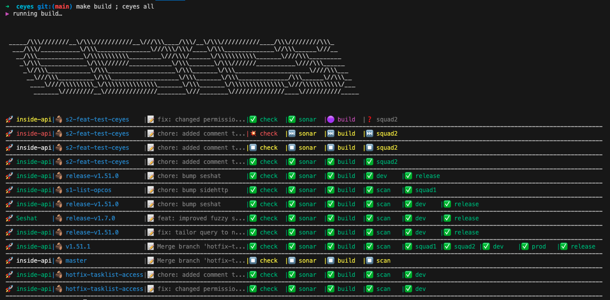

# CEYES 🕵️

This is a command-line interface (CLI) tool written in Go that allows you to view CI/CD pipelines. I was so tired of using gitlab's shitty interface and wanted to not be interrupted in my workflow when managing my CI/CD pipelines. Hence this project is a POC to visualise your gitlab pipelines for all your projects. As it goes on, I will keep on implementing new features such as cancelling specific jobs, relaunching failed jobs, etc. Potentially, I will create a UI as I think it will quickly get too complex to be managed via the cli. Let me know if you have any suggestion!



## Job Status Color Code

In the output of the program, each job status is represented by a different color and emoji:

- 🟣 Magenta: The job is currently running.
- 💥 Red: The job has failed.
- ✅ Green: The job has completed successfully.
- 👋 Blue: The job is in the 'other' status. This is a catch-all for statuses not covered by other colors.
- ⏳ White: The job is pending, meaning it is waiting to be processed.
- ⏹️ Yellow: The job has been canceled.
- ⏭️ Yellow: The job has been skipped.
- ❓ Black: The job is in an unknown status. This is used for any status not covered by the above cases.

## Installation

To install this project, you need to have Go and Make installed on your machine. Then, clone the repository and build the project:

```bash
gcl https://github.com/VincentBaron/ceyes.git && cd ceyes && make build
```

This will create an executable named `ceyes` in your project directory.

## Usage

Here are the main commands provided by this tool:

#### Display All Ongoing Pipelines

```bash
./ceyes all
```

#### Display Your Ongoing Pipelines

```bash
./ceyes me
```

#### Display the Pipeline for a Specific Project

```bash
./ceyes project [project-name]
```

#### Add a Project to the Config

```bash
./ceyes add [project-name]
```

#### Remove a Project from the Config

```bash
./ceyes remove [project-name]
```

## Make Commands

This project uses a Makefile for managing build tasks. Here are some of the available commands:

```bash
make build // build the project
make clean // clean the project
make // clean + build
```

The stage name is printed next to the emoji. If the stage name is 'production', it is shortened to 'prod'.

## Contributing

If you want to contribute to this project, please feel free to fork the repository, make your changes, and open a pull request.

## License

This project is licensed under the MIT License.

## TODO

- clean up stages display. Not working with tags CIs. Need a general approach.
- GET failed reasons
- Relaunch CIs
